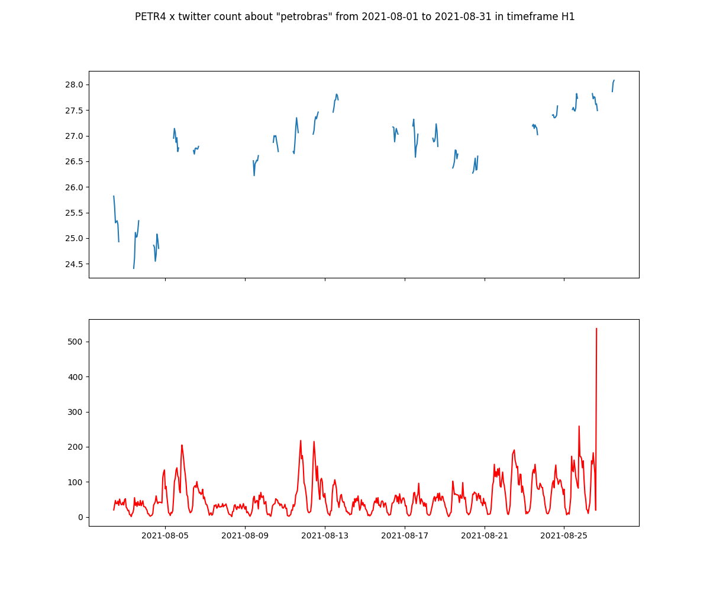

# PUCRS 2021/02 Extração e análise visual de dados heterogêneos

## Objetivo
Este projeto visa criar uma base de dados e explorar a possibilidade de dados do Twitter influenciar em algum ponto o mercado de ativos brasileiro.

Utiliza um web crawler para aquisição de tweets e a biblioteca MT5 da plataforma MetaTrader para análise gráfica dos dados.

## Como executar
### Aquisição de dados
- --query [-q] o que deve haver no Tweet
- --since [-s] desde quando deve ser executada a pesquisa
- --until [-u] até quando deve ser executada a pesquisa
- --method [-m] onde deveria gravar: mongodb ou mysql
```
python fetch_and_store.py -q petrobras -s "2021-01-01" -u "2021-12-31" -m mongodb
```

### Plotagem de dados
- --tick[-t] ativo da bolsa de valores
- --count[-c] quantidade de dados da bolsa de valores
- --query[-q] o que deve haver no Tweet para ser plotado
- --since[-s] desde quando deve ser executada a pesquisa
- --until[-u] até quando deve ser executada a pesquisa
- --frame[-f] qual o frame de tempo deve ser considerado:
  - verificar timeframes da biblioteca do mt5
- --path[-p]
- 
#### Exemplo
```
python pytwitter_mysql.py -t PETR4 -c 10000000 -q petrobras -s "2019-01-01 00:00:00" -u "2021-08-31 23:59:59" -f TIMEFRAME_D1 -p "C:\Users\guilh\Goo
gle Drive\Estudos\PPGCC\2021\02\Extração e Análise de Dados Heterogêneos\Programa"
```

##### TODO
- [ ] Plotagem via MongoDB

#### Resultado
