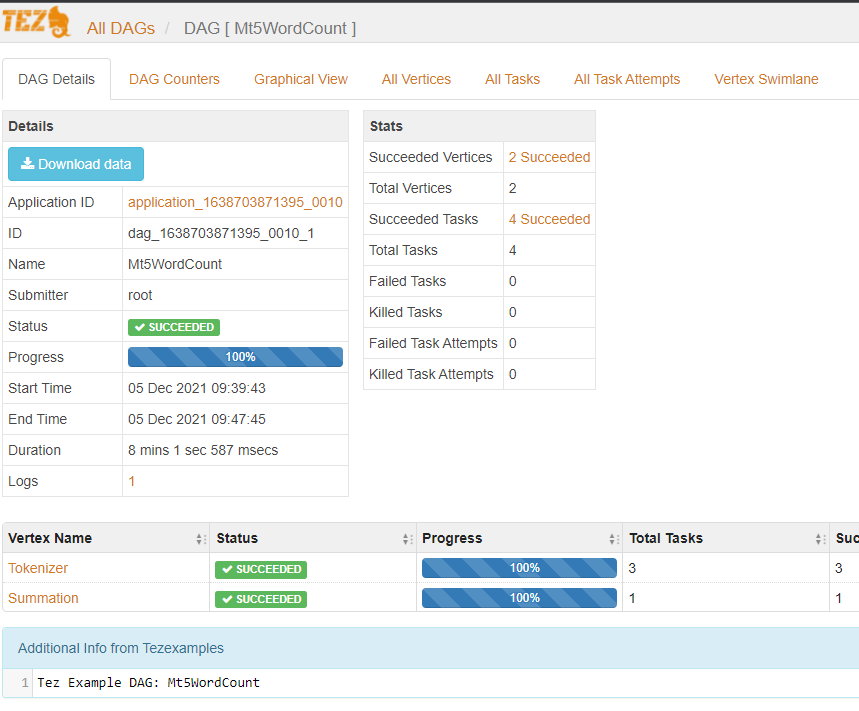

# Configuring Apache Tez to run map reduce job

## Requisitos
- docker
- maven
- Exportar dados do mongodb: `mongoexport --uri="connection_uri" -c collection --fields=i,d,q,f,r --type=csv --out=./data/mt5_database.csv --db={}`

## Comandos maquina local
- `net stop winnat`
- `docker system prune -a`
- `docker run -i -t -p 8088:8088 -p 8030:8030 -p 8031:8031 -p 8032:8032 -p 8033:8033 -p 8040:8040 -p 8042:8042 -p 8188:8188 -p 9999:9999 -p 49707:49707 -p 50010:50010 -p 50020:50020 -p 50070:50070 -p 50075:50075 -p 50090:50090 -v C:\projects\pucrs\pucrs_2021_02_extracao_e_analise_visual_de_dados_heterogeneos:/pucrs/ prasanthj/docker-tez:latest /etc/bootstrap.sh -bash`

### Iniciar o chrome sem CORS
- `"C:\Program Files\Google\Chrome\Application\chrome.exe" --disable-web-security --user-data-dir=C:\Users\guilh\chromeTemp`

## Comandos maquina virtual

### Matar processo rodando em porta de timeline
- `sudo apt update`
- `sudo apt install lsof`
- `sudo kill -9 $(sudo lsof -t -i:8188)`

### Habilitar tez-ui
- `cp /usr/local/tez/tez-ui/target/tez-ui-0.9.0-SNAPSHOT /var/www -r`
- `mv /var/www/tez-ui-0.9.0-SNAPSHOT /var/www/tez-ui`

### Copiar configuração do yarn
- `cp /pucrs/apache-tez/yarn-site.xml /usr/local/hadoop/etc/hadoop/`

### Iniciar servidor apache
- `service apache2 start`

### Iniciar o hadoop e yarn
- `cd /usr/local/hadoop/etc/hadoop`
- `./hadoop-env.sh`
- `./yarn-env.sh`
- `./httpfs-env.sh`
- `./kms-env.sh`
- `./mapred-env.sh`
- `cd /usr/local/hadoop/sbin`
- `./start-all.sh`
- `/usr/local/hadoop/sbin/yarn-daemon.sh start timelineserver`

## Paginas publicadas
- Overview: http://localhost:50070/dfshealth.html#tab-overview
- Overview data node: http://localhost:50075/
- Overview secondary data node: http://localhost:50090/status.html
- Yarn Cluster: http://localhost:8088/cluster
- Yarn Node: http://localhost:8042/node
- Apache Tez UI: http://localhost:9999/tez-ui/

## Rodar hadoop map reduce job
- /usr/local/hadoop/bin/hadoop fs -rm -r /user/root/output`
- `/usr/local/hadoop/bin/hadoop jar /usr/local/hadoop/share/hadoop/mapreduce/hadoop-mapreduce-examples-2.7.2.jar grep input output 'dfs[a-z.]+'`

## Rodar mt5 map reduce job
- `npm run maven:build`
- `docker exec -it $(docker container ls -a | awk 'NR>1 {print $1}') bash -c "cd /pucrs/apache-tez/ && ./run.sh"`

## Resultado
